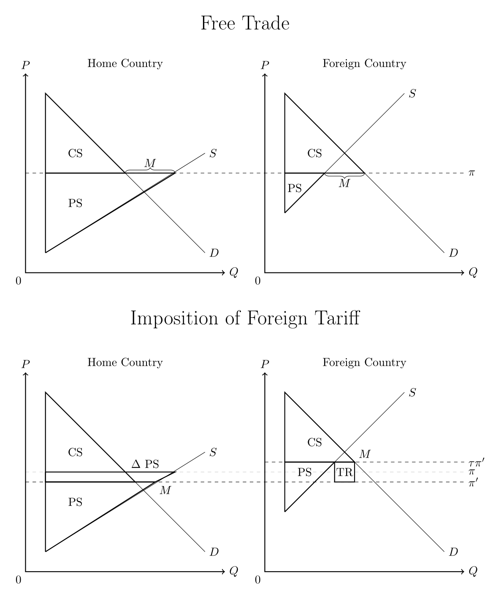
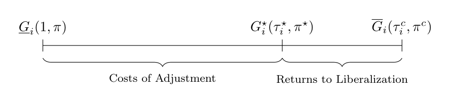
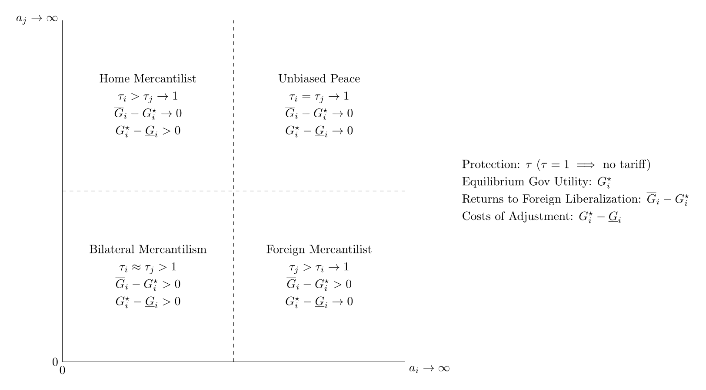

---
title       : Endogenous Protection and International Rivalry
subtitle    : IR Graduate Seminar
author      : Brendan Cooley
job         : April 6, 2017
framework   : io2012        # {io2012, html5slides, shower, dzslides, ...}
highlighter : highlight.js  # {highlight.js, prettify, highlight}
hitheme     : tomorrow      # 
widgets     : [mathjax]           # {mathjax, quiz, bootstrap}
mode        : selfcontained # {standalone, draft}
runtime     : shiny
knit        : slidify::knit2slides
--- .class #id

<div style="display:none">
  $
    \newcommand{\argmin}{\text{arg}\,\text{min}  }
    \newcommand{\argmax}{\text{arg}\,\text{max}  }
  $
</div>

## International Rivalry and Trade

- Why do international rivalries emerge and persist?
- Dyadic Rivalry: relative propensity to send costly signals and/or engage in militarized conflict (Fearon 1997)
  - Low end: denouncements/accusations/threats
  - High end: military mobilization/skirmishes/war
- Commercial Peace: trade ameliorates existing conflicts of interest - territorial, ideological, etc
  - Opportunity cost mechanism (Angell 1911; Oneal and Russet 1997)
  - Signaling mechanism (Gartzke, Li, and Boehmer 2001)
- Aberrent case: Anglo-German antagonism (Kennedy 1980; McDonald and Sweeney 2007)
  - Political economic trends: German economic growth/development $\rightarrow$ more Anglo-German trade & more import competition $\rightarrow$ tariff reform & germanophobia 
  - Similar dynamics in Germany (Gershenkron 1943)
- Lake (2014) Hypothesis: conflicts likely between 'state market' and 'liberal market' systems

--- .class #id 

## Argument in Brief

1. States can impose externalities on one another through barriers to trade
2. Government bias toward demands of particularistic producer interests affects both
  - magnitude of these externalities (protection of import competers)
  - extent to which market access abroad is valued (profits for export-oriented firms)
3. When governments exhibit mercantilist preferences (desiring protection at home and liberalization abroad), international conflicts of interest emerge
4. Conflicts of interest $\rightarrow$ conflictual behavior. Two channels:
  - Deliberate linkage strategies
  - Hostility/foreign policy belligerence 'constructed' by domestic actors that stand to benefit from trade disruption or policy concessions from foreign governments (Snyder 1993)
5. Conclusions
  - Dyadic conflicts of interest increasing in 1) government's sensitivity to particularistic interests and 2) similarity of states' economies

--- .class #id 

## Approach to the Project

1. Develop baseline $N$-country political economy of trade protection based on Grossman and Helpman (1994, 1995)
  - What trade policies do countries adopt in cooperative equilibrium?
2. Define and explore properties of dyadic conflicts of interest based on model
  - How far apart are a given pair of governments' ideal bilateral trade policies?
3. Structurally estimate government bias (Goldberg and Maggi 1999; Mitra, Thomakos and Ulubasoglu 2006; Gawande, Krishna, and Olarreaga 2009, 2012, 2015)
  - Based on observed protection and economic data, what can we infer about extent to which government values social welfare relative to political contributions?
4. Estimate empirical dyadic conflict of interest (in progress)
5. Link latent conflict of interest to dyadic rivalry score based on ICEWS event data (in progress)
  - Do states with larger underlying trade policy conflicts of interest adopt more belligerent foreign policies toward one another?

--- .class #id 

## Model (Domestic Side)

- Actors:
  - $K$ politically-organized sectors
  - $N$ biased governments, each of which cares about some mix of social welfare and 'political contributions'
- Governments' objective function ($\tau_{ik}$ - trade policy, $\pi_k$ - international price):
$$
G_i(\vec{\tau_i}, \vec{\pi}) = \sum_{k=1}^K \underbrace{C_{ik}(\vec{\tau_i}, \vec{\pi})}_{\text{contributions}} + a_i \underbrace{W_{i}(\vec{\tau_i}, \vec{\pi})}_{\text{social welfare}}
$$
- Government ideal types
  - Kleptocrat (contribution maximizing govt): $a_i \rightarrow 0$
  - 'Perfect' Democracy (social welfare maximizing govt): $a_i \rightarrow \infty$
- Domestic influence game: sectors announce contribution schedules (mapping between potential trade policies and contributions) to maximize net welfare

--- .class #id 

## Model (International Side)

- $N$ governments with preferences determined by domestic influence game negotiate international trade policy regime (cooperative equilibrium)
- Bagwell and Staiger (1999): GATT/WTO principles of reciprocity/nondiscrimination allow for realization of efficient outcome, from persepective of mercantilist governments
$$\nabla_{\tau_k} G_i(\vec{\tau_i}, \vec{\pi}) = 0 \quad \forall \text{ } i, k$$
- If all governments were social-welfare maximizing $a_i \rightarrow \infty$), result would be free trade
- Since governments in fact exhibit mercantilist preferences, global trade regime maintains some degree of protectionism
- What does global trade regime look like in cooperative equilibrium?

--- .class #id 

## Characteristics of Equilibrium Protection

Equilibrium protection:
$$
\tau_{ik}^\star - 1 = \frac{1}{a_i} \frac{X_{ik}}{\pi_k M_{ik}^\prime}
$$
- Components:
  - $\tau_{ik}^\star = 1 + t_{ik}^\star$: magnitude of protection in country $i$ of sector $k$ ($t_{ik}$ - ad valorem tariff)
  - $a_i$: government bias 
  - $X_{ik}$: economic production from sector $k$ in country $i$
- Characteristics:
  - Decreasing in weight government places on social welfare ($a \rightarrow \infty$)
  - Increasing in economic size of sector $k$ ($X_{ik}$)
- Punchline: More representative governments adopt freer trade regimes (Milner and Kubota 2005) and larger industries secure more protection

--- &twocol

## Conflicts of Interest

*** =left
</img>

*** =right
- Foreign tariffs cause a shift in the world price when the foreign country is 'large'
- Causes reduction in producer welfare in the home country (consumer surplus expands)
- Profit shifting dynamic: foreign government attempts to onshore production through use of trade policy
- How does home government evaluate welfare changes induced by change in international price? Depends on its bias

--- .class #id 

## Ideal Points and Decomposition

</img>

- When $a$ sufficiently small, governments always desire open markets abroad
- Ideal point: *bilateral* trade policy government A would adopt if it controlled policy instruments in countries A and B (yields utility $\overline{G}$)
- $\underline{G}$ - utility of government A evaluated at B's ideal point
- Returns to foreign liberalization - utility gains from B's liberalization
- Costs of adjustment - utility losses from A's own liberalization

--- .class #id 

## Bias, Trade Policy, and Bilateral Relations

</img>

--- &twocol

## Data (Protection by ISIC Sector, 1989-2001)

https://brendancooley.shinyapps.io/tpp-explorer/

*** =left
```{r, echo=FALSE, message=FALSE, warning=FALSE}
library(dplyr)
library(readr)
library(ggplot2)
library(ggthemes)
library(cowplot)

tradeA <- read_csv('tradeA.csv')
tradeA$ID <- as.character(seq(1, length(tradeA$ccode)))
tradeA$tau_imput <- as.factor(tradeA$tau_imput)

countries <- c("BGD","BRA","COL","MYS")

t <- tradeA
tradeA$applied <- (t$tar_iwahs - 1) / t$tar_iwahs
tradeA$appliedNTB <- (t$tar_iwahs + t$ave_core_wgt - 2) / (t$tar_iwahs + t$ave_core_wgt - 1)

# remove outliers
tradeA <- filter(tradeA, inv_imp_pen_elast < 100)
# select countries of interest
tradeA <- filter(tradeA, ccode %in% countries)
# only import competers
tradeA <- filter(tradeA, net_imp_tv > 0) 

# Applied Plot
base <- tradeA %>% ggplot(aes(x=inv_imp_pen_elast, y=applied)) + geom_point(size=.2) +
  geom_smooth(method = 'lm', se = FALSE, formula = y ~ x - 1, color = 'red', size = .5) +
  theme_bw() + xlab('Inverse Import Penetration Ratio (Inverse Elasticity-Scaled)') +
  ylab('Applied Tariff Rate (t-1)/t') + xlim(0,100) + ylim(0,.5) +
  theme(plot.background = element_blank(),
        panel.grid.major = element_blank(),
        panel.grid.minor = element_blank())
base + facet_wrap(~ ccode, ncol = 2) + 
  ggtitle('Model-Implied Kleptocrats')
```

*** =right
```{r, echo=FALSE, message=FALSE, warning=FALSE}
tradeA <- read_csv('tradeA.csv')
tradeA$ID <- as.character(seq(1, length(tradeA$ccode)))
tradeA$tau_imput <- as.factor(tradeA$tau_imput)

countries <- c('AUS','JPN','NOR','USA')

t <- tradeA
tradeA$applied <- (t$tar_iwahs - 1) / t$tar_iwahs
tradeA$appliedNTB <- (t$tar_iwahs + t$ave_core_wgt - 2) / (t$tar_iwahs + t$ave_core_wgt - 1)

# remove outliers
tradeA <- filter(tradeA, inv_imp_pen_elast < 100)
# select countries of interest
tradeA <- filter(tradeA, ccode %in% countries)
# only import competers
tradeA <- filter(tradeA, net_imp_tv > 0) 
# Applied Plot
base <- tradeA %>% ggplot(aes(x=inv_imp_pen_elast, y=applied)) + geom_point(size=.2) +
  geom_smooth(method = 'lm', se = FALSE, formula = y ~ x - 1, color = 'red', size = .5) +
  theme_bw() + xlab('Inverse Import Penetration Ratio (Inverse Elasticity-Scaled)') +
  ylab('Applied Tariff Rate (t-1)/t') + xlim(0,100) + ylim(0,.5) +
  theme(plot.background = element_blank(),
        panel.grid.major = element_blank(),
        panel.grid.minor = element_blank())
base + facet_wrap(~ ccode, ncol = 2) + 
  ggtitle('Model-Implied Democrats')
```

--- .class #id 

## Next Steps
1. Alternative models: sensitivity of estimates to different assumptions
  - Intermediate goods and counterlobbying (Gawande, Krishna, and Olarreaga 2012)
  - New Trade & New New Trade effects - ambiguous
2. Estimation of empirical conflicts of interest
3. Latent variable model of rivalry using ICEWS data

## Conclusions
- Conflicts of interest vary dramatically as a function of governments' bias toward particularistic interests (Jackson and Morelli 2007)
- Biased governments demonstrate more conflictual preferences in the realm of trade - alternative mechanism underlying democratic peace?
- Qualification of commercial peace literature - peace caused by preferences for openness rather than magnitude of trade flows
